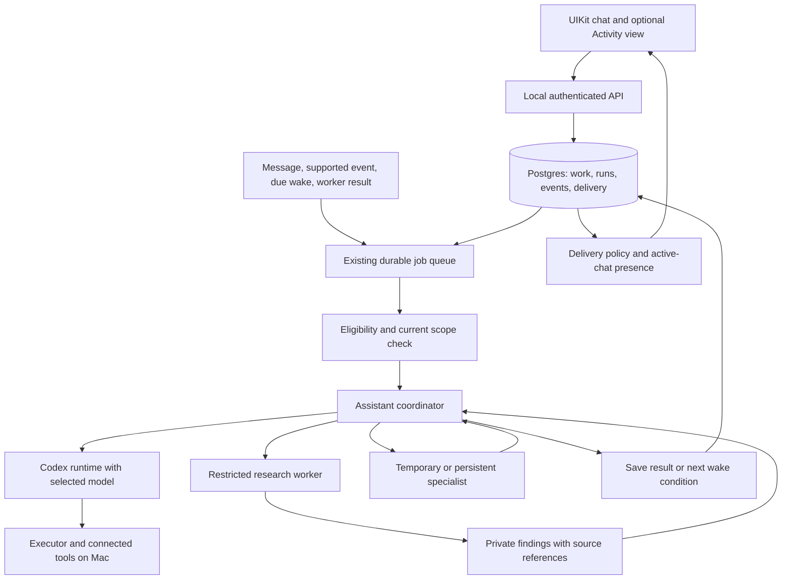

# Dots research and Negroni proactivity

Reviewed September 29, 2026. This document separates published product behavior from the proposed Negroni implementation. It does not claim access to OpenAI's private prompts, scheduler, memory schema, ranking algorithm or source code. The implementation below is pending unless explicitly marked shipped.

## Verified primary sources

| Source | Finding relevant to this product |
| --- | --- |
| [Introducing dots](https://openai.com/index/introducing-dots/) | One primary assistant can own several projects while remaining available for conversation. It learns from feedback and coordinates work through connected tools. The launch distinguishes the personal assistant from enterprise specialist pilots. |
| [Tasks and memory](https://learn.chatgpt.com/docs/dots/tasks-and-memory) | Assigned work can pause and resume at agent-selected times. Recurring schedules and supported event monitoring are separate mechanisms. Conversation context, ChatGPT memory and the assistant's private notes have different roles; delegated tasks receive selected context. |
| [Safety, security and privacy](https://openai.com/index/how-we-build-safety-security-and-privacy-into-dots/) | Proactive research uses code-restricted read-only tools and returns private notes to the assistant. Subsequent actions go through their applicable controls. The execution environment cannot modify the separate action-review enforcement. |
| [Controls](https://learn.chatgpt.com/docs/dots/controls) | Existing authorization can cover continuing work. Pausing the main task, stopping a worker and cancelling a schedule are distinct operations. Activity exposes ongoing work and requests for input. |
| [System card, section 12](https://deploymentsafety.openai.com/gpt-6-astra/alignment-in-persistent-and-proactive-workflows) | The product combines time budget and reasoning effort. Evaluations exercise waits, changing scope and permission, and chained tasks. This supports testing those conditions, but does not reveal the production wake algorithm or prove indefinite uninterrupted inference. |
| [Computers and apps](https://learn.chatgpt.com/docs/dots/computers-and-apps) | Computer availability and access permission are distinct. Existing tasks remain bound to their execution environment. Negroni deliberately uses the connected Mac only. |
| [Codex App Server](https://openai.com/index/unlocking-the-codex-harness/) | Documents the Codex integration boundary: a persistent service, threads, turns and streamed items. Useful for Negroni's execution layer; not evidence that every Dots internal component is identical to Codex. |

[Peter Yang's supplied video](https://www.youtube.com/watch?v=z5X1eMU6isI) was identified from its public title, description and chapters. Its description discusses business assistance and its chapters include research, comment analysis and launch work. Full captions were unavailable through the attempted public endpoints; the video was not played and no audio was started. Do not treat the chapter list as verification of every demonstrated interaction.

Public sources leave the production wake cadence, prioritization model, exact prompts, context-selection algorithm and memory representation unspecified. Negroni must make and test its own choices there.

## Product decisions

The following are Negroni design decisions, not descriptions of Dots internals.

The primary conversation belongs to one assistant. It owns results even when another worker executes a step. Personal, Team and an article discussion use the same model registry and execution rules. Team is an optional inspection surface, not another assistant mode the user must manage.

Three background activities have different contracts:

1. **Continue assigned work.** The user has asked for an outcome. The assistant can execute the next authorized step, delegate, await a result or save a future check. The outcome remains open while waiting, even when an individual run has finished.
2. **Discover useful changes.** A separately enabled research scope allows reading selected sources. Researchers produce evidence-backed private findings. They cannot send messages, edit apps, drive the computer or create more agents or schedules.
3. **Run an automation.** An explicit saved schedule defines repeat timing, scope and delivery. Its existing controls remain under For you → Automations. Cancellation removes future invocations.

An interest learned from conversation can improve article selection. It does not authorize a project, a reminder, an account monitor or contacting somebody. Greetings continue to get conversational answers without a work inventory.

## Execution on the Mac

All coordination, queue processing, local tool execution and persistence use the existing Mac backend. Connected model providers still receive their normal inference requests. There is no new virtual computer. When the Mac sleeps or disconnects, work waits; the phone must display that accurately. On recovery, one bounded catch-up replaces a burst of every missed check.

Keep the existing Codex tool loop as the execution unit. Put eligibility, persistent waiting, budgets and delivery around it. A model cannot keep a responsibility alive merely by promising to return later. A persisted wake or supported event subscription must exist before the assistant confirms that promise.

## Reuse and gaps found in the current code

| Existing implementation | Reuse | Required addition |
| --- | --- | --- |
| `packages/core/src/main-assistant.ts` | Main-assistant identity, hierarchy, conversation and coordination policies | Inject only current responsibility context; retain quiet greeting behavior |
| `packages/adapters/src/codex-runtime.ts` | Codex App Server bridge, streamed tools, cancellation, per-turn tool ceiling | Pass work deadline and remaining allowance; do not use a live turn as a long sleep |
| `packages/adapters/src/executor.ts` | Runs, leases, checkpoints, approvals, tool auditing, terminal outcomes | Enforce the work scope and research capability boundary on each call |
| `packages/adapters/src/job-reconciler.ts` | Durable recovery and single reconciliation leader | Recover due adaptive wakes and unpublished findings without duplicate runs |
| `packages/adapters/src/schedule-tools.ts` | Saved recurring and one-shot routines | Keep routine creation restricted; add bounded continuation rather than recursively creating schedules |
| `packages/adapters/src/memory-context.ts` | Read relevant memory on demand; treat history as evidence | Separate sourced research notes from accepted work and durable user facts |
| `packages/adapters/src/feed-profile.ts` and `personal-feed.ts` | Interest learning, explicit exclusions, deduplication and daily limits | Route selected research findings into the feed through the coordinator |
| `packages/core/src/action-approval.ts` | Existing user rules and action review | Do not mistake approval exemptions or connector naming heuristics for a research sandbox |
| `threads.activity`, native `ToolActivityView` | Real tool lifecycle and native detail sheet, shipped in build 34 | Add responsibility-level waiting/paused/completed states above individual tool calls |

The implementation status is recorded below. A cron job with a broad prompt alone would leave these lifecycle and capability boundaries unresolved.

## Persistent work contract

Add a responsibility record only for user-authorized continuing work. Reuse `Task` and `Run` for individual executions; do not rename their existing completion status to mean the overall outcome succeeded.

Suggested record fields:

- Identity: workspace, owner, main assistant, originating thread, stable work ID.
- Authorization: source user message, objective, permitted sources/actions, scope version.
- State: active, waiting, needs input, paused, completed or cancelled.
- Continuation: next wake time or supported event condition, reason, latest checked source cursor.
- Evidence: last verified result, outstanding dependency and completion evidence.
- Delivery: destination, meaningful-change condition and latest delivered finding key.
- Bounds: deadline, maximum work allowance, accumulated usage, retry count.
- Concurrency: record version and a single active run claim.

Persist a proposed next wake transactionally with the current outcome. A stable `(workId, scopeVersion, wakeVersion)` key prevents duplicate invocation. The queue job is a delivery mechanism; the database remains authoritative. A reconciler can repair a crash between committing the state and publishing its job.

Before a wake starts, check current scope, cancellation, expiry, account access, budget, host availability and an existing run. Before an external action, check scope again. A stale worker result is allowed to become historical evidence but must not reactivate cancelled work or bypass a newer instruction.

No new Goals tab is required. Users assign and correct work in conversation. Activity exposes state and native stop/resume controls when needed.

## Choosing when to wake

The initial implementation should prefer concrete evidence over constant polling:

- A worker result or supported source event triggers a check immediately.
- A known deadline or expected availability gives a specific future check.
- A source without events can use bounded polling within an accepted monitoring scope.
- No change increases the delay up to the scope's freshness requirement.
- Missing permission or a user decision suspends retries until something changes.
- Completed, dismissed and cancelled work has no next wake.

The coordinator may propose a reason and time. Server validation enforces limits, current authorization and the deadline. On startup, re-evaluate whether an overdue task is still useful before spending another model call. This is an implementation choice; no public source establishes OpenAI's exact timing policy.

## Read-only research boundary

Use a separate execution mode with an explicit set of vetted adapters. Do not hand it the general assistant's shell, browser, computer, credential, messaging, write, scheduling or delegation tools. Hiding tools from the prompt is insufficient: reject unapproved tool calls at dispatch too.

A generic connector executor must not be admitted because its outer name or `readOnly` hint looks harmless. Validate the actual selected operation and account against the research scope, or omit that connector from research until a restricted adapter exists. Research consumes a finite tool/time allowance and cannot spawn an unrestricted child.

Return structured findings to a server-owned store. Fields: topic/work reference, summary, source IDs/URLs, observed time, expiry, source version, confidence, proposed relevance and content fingerprint. A finding is not a user instruction and cannot grant permission. Store it as tentative evidence; only a verified correction or explicit user statement should update durable user facts.

Use the existing memory provider for relevant knowledge and project context. Keep operational waiting state and delivery receipts in Postgres, where ownership, transactions and concurrency can be enforced. Do not create a competing markdown task queue.

## Choosing what reaches the user

Delivery happens after evidence checking, separately from task completion. The coordinator considers whether the finding is new, relevant now, supported, within scope and useful to act on. Deterministic gates then enforce dismissal, deduplication, scope, quiet hours and delivery limits.

| Outcome | Destination |
| --- | --- |
| Nothing changed | Private check record only |
| Useful article or reference | For you card with source and article discussion |
| Verified result of assigned work | Original conversation, including specialist evidence |
| Decision or time-sensitive change | Original conversation; push only if allowed and not already viewing that chat |
| Routine internal progress | Activity, without a new user message |
| Missing connection | One actionable request; wait for reconnection |

Keep delivery idempotent with a key derived from work/topic, source revision and material change. Record which message was delivered. A failed push must not create a second chat message, and successful APNs submission must not be treated as chat delivery. The active-chat foreground suppression stays in both client presentation and server presence handling.

Dismissal suppresses the topic until a material new source change or explicit user request. A completed task stays completed. Renaming an observation does not make it a new reason to notify.

## Models and user control

Use existing active provider/model connections. Keep manual chat selection. Background classification can use the configured fast model; substantive investigation can route to a configured capable model. Capability checks and daily allowance apply before escalation. A provider failure should preserve waiting work and expose one actionable problem rather than restart a new assistant.

In the assistant profile, expose background research enable/pause, permitted sources, work allowance and notification preferences. Reveal detailed controls on demand. Show active work with real last-check/next-check state. Automation pause/delete affects future runs; stopping the current run is a separate action. Offer a clearly named stop-all-background-work operation if implemented, and actually revoke pending wakes and stop child runs.

For you remains a reading surface. The user can hide a card, mute a topic and discuss an item; these actions feed the existing profile and deduplication rules. Routine controls live in its automation category. Avoid an always-visible customization card.

## Required offline and integration scenarios

1. A greeting after a background check produces no old-task recap.
2. Discussion of an interest produces no new responsibility or monitoring subscription.
3. The same source version seen repeatedly produces at most one delivered finding.
4. A source conflict contains both references and identifies uncertainty rather than inventing a correction.
5. Dismissed/completed/cancelled work does not return under another title.
6. A new user instruction or revoked connection wins over a queued wake and an in-flight result.
7. Read-only research cannot call mutating connector actions, generic shell, browser or unrestricted children, including disguised compound operations.
8. Two workers and a restart around queue publication produce one continuation and one delivery.
9. An offline Mac resumes with one useful check; no missed-check flood.
10. No-change checks back off; budget exhaustion stops model work without discarding state.
11. Delegated completion returns to the original personal/group/feed conversation and preserves model selection.
12. Opening the relevant chat suppresses foreground push while tool activity and results still arrive.
13. Pausing current work, pausing all background work and deleting an automation have their documented distinct effects.
14. A successful tool invocation without verified requested output leaves the responsibility open.

## Delivery sequence and evidence boundary

Build 34 ships native tool activity and message-reconciliation fixes. It does not ship this full proactivity system.

Implement persistent responsibility and adaptive wake transitions first, using the existing queue and recovery machinery. Then integrate restricted research and findings, followed by selection/delivery and native controls. Run the scenarios above against isolated fake services before enabling recurring research on real accounts. Expand connected research sources only when their operation boundaries are enforced.

### Local implementation: persistent assigned work

The first implementation is now present in the source checkout, not yet in the installed backend or TestFlight. `AssistantWork` stores the originating user request, objective, current outcome, selected model, next check, deadline and run allowance. The existing elected reconciler claims due work under a conversation lock and publishes an ordinary run; the existing queue recovery repairs a missed publication. An unchanged wake can finish silently without another chat bubble. Run completion alone leaves the responsibility needing attention unless the assistant explicitly saves an outcome.

Current user turns can create responsibilities through `work_create`; background runs cannot create or reactivate them. `work_update` saves waiting, a request for input or completion evidence. Native chat exposes “Ongoing work” in its overflow menu, with details, pause/resume and swipe-to-stop. Version checks reject stale updates after controls change. Expiry, revoked space membership and missing conversation/assistant availability stop further checks. Clearing the originating conversation removes its responsibilities.

Validation: 17 real PostgreSQL lifecycle cases, one full executor scenario with scripted model events, and 228 adjacent API/executor/reconciler regressions pass. The executor scenario covers creation, persisted wake, task-model routing and a silent unchanged result through actual tool dispatch. Adapter/API/worker typechecks and the UIKit simulator build pass. All services in these scenarios are fake; no paid model or real account is used. Native touch behavior and actual model judgment remain unverified.

This foundation does not yet implement independent discovery, restricted research tools, evidence ranking, source-change deduplication, daily inference allowances, or stop-all controls. A running external operation may already have taken effect when stopped; the current cancellation fence prevents subsequent tool dispatch and future wakes. Source-backed discovery and its delivery policy remain the next implementation stage.

Acceptance needs both backend recovery tests and actual native interaction checks. Passing an archive or reaching TestFlight does not verify touch behavior or end-to-end proactive relevance on a physical phone.

### Local implementation: bounded public discovery

The second source change adds opt-in discovery under For you → Feed settings. An ordinary UIKit switch enables it; checks per day and existing source/topic controls define its scope. It is independent of conversation-interest learning. No interest alone creates a monitor or responsibility. Status reports the next check, current collection and rolling allowance.

The existing elected reconciler creates one persisted research cycle with a five-minute deadline. A separate internal thread keeps the main conversation available. The researcher receives only eligible public topics, allowed domains and previously seen URLs, with no conversation history, agent secrets, computer, connector, messaging, memory-write, schedule or delegation tools. The ordinary model registry resolves its conversation model; an isolated runtime request exposes only public search, page reading and private finding submission. Dispatch rechecks current authorization and enforces twelve tool calls. Domain restrictions apply before every page request, including redirects.

Each private finding needs a source read in that run, an exact supporting quote, an eligible topic and a confidence threshold. The source fingerprint, quotation, relevance text and expiry are stored. Successful completion passes findings through current scope, exclusion, novelty and daily publication gates before creating feed cards. Hidden or previously seen URLs do not return. Preview images come from the fetched page metadata rather than model-invented links. The current selector combines the research model's relevance judgment with these deterministic gates; it does not claim to reproduce Dots' private ranking algorithm or run a separate coordinator model for each article.

Discovery never posts narration or pushes to the chat. Empty checks back off. Pausing or changing scope cancels the current cycle and rejects late findings; revoked membership and expiry stop dispatch. Both continuing work and discovery run through the existing backend on the Mac. No virtual computer is created, and the discovery executor never provisions or controls a computer.

Current boundaries: this discovery mode reads public web sources, not signed-in account connectors. Explicitly assigned ongoing work can use the assistant's existing authorized tools. Source events, semantic cross-URL story clustering and a single stop-all control remain additional work. This implementation and its UI have not yet been deployed or uploaded; interactive native verification is unavailable because the native UI automation tool cannot access the simulator.
